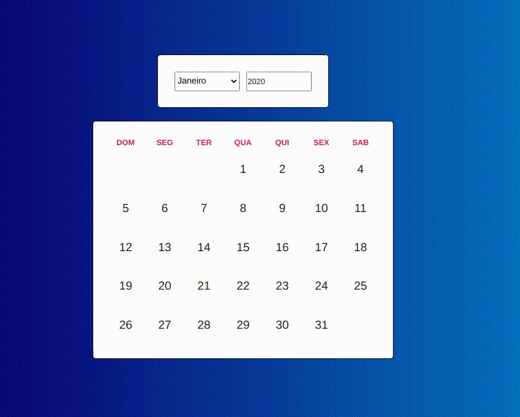

<!-- banner -->
<h1 align="center">
  
</h1>

<!-- título -->
<h1 align="center">
  Challenge para desenvolvedor Full Stack
</h1>

<!-- descrição -->
<h2 align="center">
  Challenge usando Adonis e React.
</h2>

<p align="center">
  
  <image src="https://img.shields.io/github/last-commit/jonathasribeiro/challenge-adonis-react"/>
  
</p>

<!-- status -->
<p align="center"><b>Status: Concluído ✅</b></p>

---

<!-- index -->
<p align="center">
  <a href="#-sobre">Sobre</a> •
  <a href="#-tecnologias">Tecnologias</a> •
  <a href="#-executando-o-projeto">Executando o projeto</a> •
  <a href="#-arquivo-insomnia">Insomnia</a> •
  <a href="#-licença">Licença</a>
</p>

## 📄 Sobre

O objetivo do **Challenge** é criar no backend, uma API que se relaciona com duas tabelas, e no frontend, um componente de calendario.

Este projeto foi desenvolvido no dia **09/09/2020**. 

---

## 🔨 Tecnologias

Estas são as principais tecnologias utilizadas na construção do projeto:

- [AdonisJS](https://adonisjs.com/)
- [Node.js](https://nodejs.org/en/)
- [ReactJS](https://reactjs.org/)

---

## 🚀 Executando o projeto

Antes de qualquer coisa, você precisa ter  o [Git](https://git-scm.com), o [Node.js](https://nodejs.org/en/), e o [AdonisJS](https://adonisjs.com/) instalado na sua máquina. Feito isso, você pode prosseguir.

### 📂 Instalando dependências

```bash
# Clone este repositório:
$ git clone https://github.com/jonathasribeiro/challenge-adonis-react

# Acesse à pasta do projeto:
cd challenge-adonis-react

# Vá à pasta backend:
cd backend

# Instale as depêndencias:
npm install ou yarn 

# Vá à pasta frontend:
cd ../frontend

# Instale as depêndencias:
npm install ou yarn 

# Volte à pasta do projeto:
cd ..
```

---

### 💾 Rodando o servidor (back-end)

Antes de rodar o servidor pela primeira vez, você precisa criar o banco de dados, neste caso usei o Docker para criar um Container.

```bash
# Vá à pasta backend:
cd backend

# Crie o banco de dados:
docker run --name <NOME DO CONTAINER> -e POSTGRES_PASSWORD=docker -p 5432:5432 -d -t postgres 

# Abra o Arquivo .env.example e renomeie para .env

# Passe os dados do seu banco de dados SQL, no caso utilizei o postgres

# Execute o server em modo de desenvolvimento:
adonis serve --dev
```

---

### 💻 Rodando a aplicação web (front-end)

Com o servidor rodando, abra um novo terminal e entre na pasta do projeto.

```bash
# Vá à pasta frontend:
cd frontend

# Execute o site em modo de desenvolvimento:
npm run start ou yarn dev
```
Caso a página não abrir automaticamente, acesse: http://localhost:3000

---

## Arquivo Insomnia

Clique no link e tenha facil acesso ao arquivo do Insomnia para o uso da API

[](https://insomnia.rest/run/?label=Challange%20Adonis%20React&uri=https%3A%2F%2Fraw.githubusercontent.com%2Fjonathasribeiro%2Fchallenge-adonis-react%2Fmaster%2Fbackend%2Fexport.json)

---

## 📋 Licença

Esse repositório está sobe a licença [MIT](https://github.com/jonathasribeiro/challenge-adonis-react/blob/master/LICENSE).

Desenvolvido por Jonathas Ribeiro 🚀 [Entre em contato!](https://www.linkedin.com/in/jonathasribeiro151)

---
